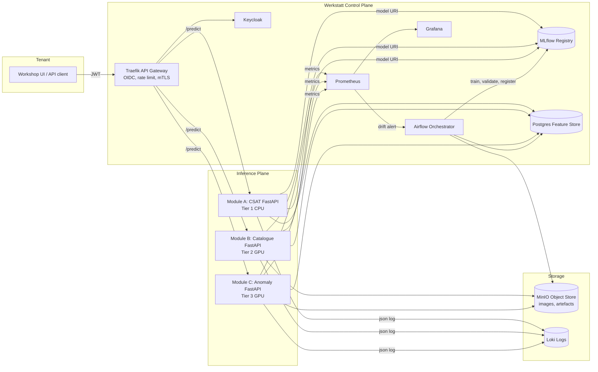
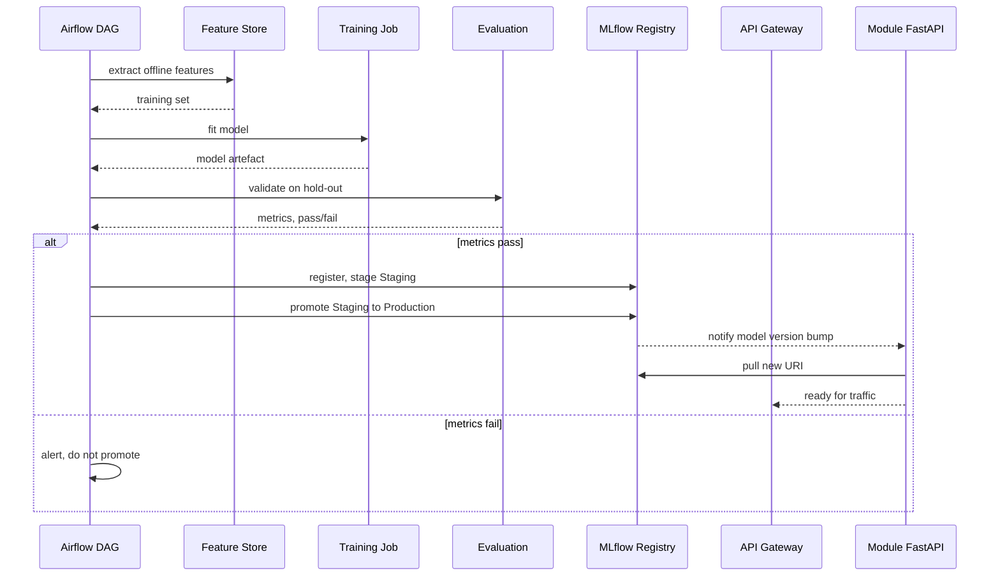

# Data Flow Diagram

## 1. Mermaid: end-to-end request and training flow



## 2. Mermaid: training to deployment lifecycle



## 3. ASCII: data flow at request time

```
   Workshop                  Werkstatt AI
   --------                  ------------
                                                          
   [Client] --HTTPS+JWT-->  [Traefik]  --OIDC-->  [Keycloak]
                              |
                              |  routed by /api/<module>
                              v
                   +-----------+-----------+
                   |           |           |
                   v           v           v
                 [A CSAT]   [B Catalog]  [C Anomaly]
                   |           |           |
                   |           +--read-->  [MinIO S3]
                   |           |           |
                   +-----+-----+-----+-----+
                         |           |
                         v           v
                   [Postgres FS]  [MLflow Reg]
                                          
                   metrics scraped every 15 s
                              |
                              v
                        [Prometheus] -> [Grafana / Alertmanager]
```

## 4. Drift detection feedback loop

```
[Live request] --> [Module] --> [feature snapshot to Postgres]
                                       |
                                       v
                                 [PSI calculator job, hourly]
                                       |
                              PSI > 0.25 on N features
                                       |
                                       v
                              [Alertmanager -> Airflow trigger]
                                       |
                                       v
                              [Retrain DAG starts]
                                       |
                              [pass / fail logged]
                                       |
                              [auto-promote on pass]
```

## 5. Notes

- Every arrow above is in scope for v1.0 implementation. v1.0 (this
  implementation) only defines the topology.
- The drift loop is the most opinionated part of the design: it intentionally
  trades a small false-positive retraining cost for the much larger cost of a
  silently degrading model in production. References 9 to 12 in
  `reports/references.md` justify the threshold choices.
